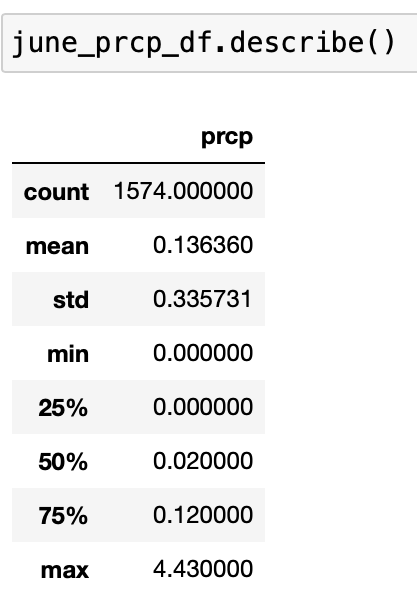

# surfs_up

## Overview of the analysis:

We have analyzed weather data to know more about temperature trends in Oahu, Hwaii, before opening a surf and ice cream shop. Specifically, the investor wanted to know  temperature data for the months of June and December in Oahu, for determining if the surf and ice cream shop business is sustainable year-round.

In this project, we have used Python, Pandas functions and methods, and SQLAlchemy, to analyze weather measurments in a SQLite database. The measurement data table was filtered date informationto retrieve all the temperatures in Hwaii for the months of June and December from data stored inside SQLite database. These data were converted to a list,a DataFrame was created, and the summary statistics were generated.

Software used: Jupiter Notebook, VS Code, and SQLite

## Results: 

We have observed a trend for decrease in temperature for December compared to June (Table 1).

- Minimum temperature in Oahu, Hwaii,is 8 degrees higher in June when compared to December:
  - June (64 degrees), December (56 degrees)
 
- Maximum temperature in Oahu, Hwaii is closer in both June and December, but it is somewhat higher in June when compared to December:
	- June (85 degrees) December (83 degrees)
	
- Median temperature in June is 75 whereas it is 71 in December. Mean and median temperatures are similar (75 for June and 71 for December. 

**Table 1. Temperature statistics for June and December in Oahu, HI** 
| Temperature     | June | December     |
| :---        |    :----:   |    :----:   |
| Count     | 1700       | 1517   |
| mean   | 74.9        | 71.0      |
| std   | 3.3        | 3.8      |
| min   | 64        | 56      |
| 25th%  | 73        | 69      |
| 50%   | 75        | 71      |
| 75%   | 77        | 74      |
| Max   | 85        | 83      |

## Screenshots for some results are shown below. 

## A. Temperature in June

**Data Frame: June temperatures** 

**June temperature Statistics**

## B. Temperature in December

**Data Frame: December temperatures** 

**December temperature Statistics**

## C. ADDITIONAL ANALYSES WERE PERFORMED ON PRECIPITATION FOR JUNE AND DECEMBER.
Temperatures over the month were plotted to visualize the trends.

## JUNE

## Temperatures

**Plot of temperatures over the month**

## Precipitation

**Data Frame: June precipitation** 

**June precipitation Statistics**

**Data frame: December precipitation with dates**

**June precipitation plot**

## DECEMBER

**Temperatures**

**Plot of temperatures over the month**

**Precipitation

**Data Frame: December precipitation** 

**December precipitation Statistics**

**Data frame: December precipitation with dates**

**December precipitation plot**

## Summary: 

Provide a high-level summary of the results and two additional queries that you would perform to gather more weather data for June and December.

- Minimum temperature in Oahu, Hwaii,is 8 degrees higher in June when compared to December:
  - June (64 degrees), December (56 degrees)
 
- Maximum temperature in Oahu, Hwaii is closer in both June and December, but it is somewhat higher in June when compared to December:
	- June (85 degrees) December (83 degrees)
	
- Median temperature in June is 75 whereas it is 71 in December. Mean and median temperatures are similar (75 for June and 71 for December. 
