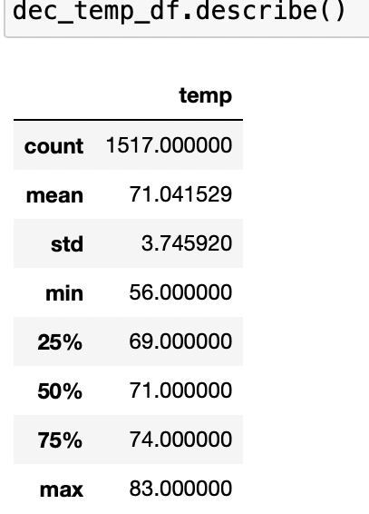

# surfs_up

## Overview of the analysis:

In this project, we have used Python, Pandas functions and methods, and SQLAlchemy, to analyze weather measurments in a SQLite database. The measurement data table was filtered date informationto retrieve all the temperatures in Hwaii for the months of June and December from data stored inside SQLite database. These data were converted to a list,a DataFrame was created, and the summary statistics were generated.

Explain the purpose of this analysis.

Software used: Jupiter Notebook, VS Code, and SQLite
## Results: 

Provide a bulleted list with three major points from the two analysis deliverables. Use images as support where needed.

Link to June temperatures: 

ink to June temperature Statistics: 

Link to December temperatures: 

ink to December temperature Statistics: 

## Summary: 

Provide a high-level summary of the results and two additional queries that you would perform to gather more weather data for June and December.

Deliverable 3 Requirements

Structure, Organization, and Formatting (6 points)

The written analysis has the following structure, organization, and formatting:
There is a title, and there are multiple sections. (2 pt)
Each section has a heading and subheading. (2 pt)
Links to images are working and displayed correctly. (2 pt)
Analysis (14 points)

The written analysis has the following:
Overview of the statistical analysis:
The purpose of the analysis is well defined. (3 pt)
Results:
There is a bulleted list that addresses the three key differences in weather between June and December. (6 pt)
Summary:
There is a high-level summary of the results and there are two additional queries to perform to gather more weather data for June and December. (5 pt)

ETL/blob/51d9b45a7ed8d6d5cda1e266268cb4c9ae5e8bff/ETL_clean_wiki_movies.ipynb)
